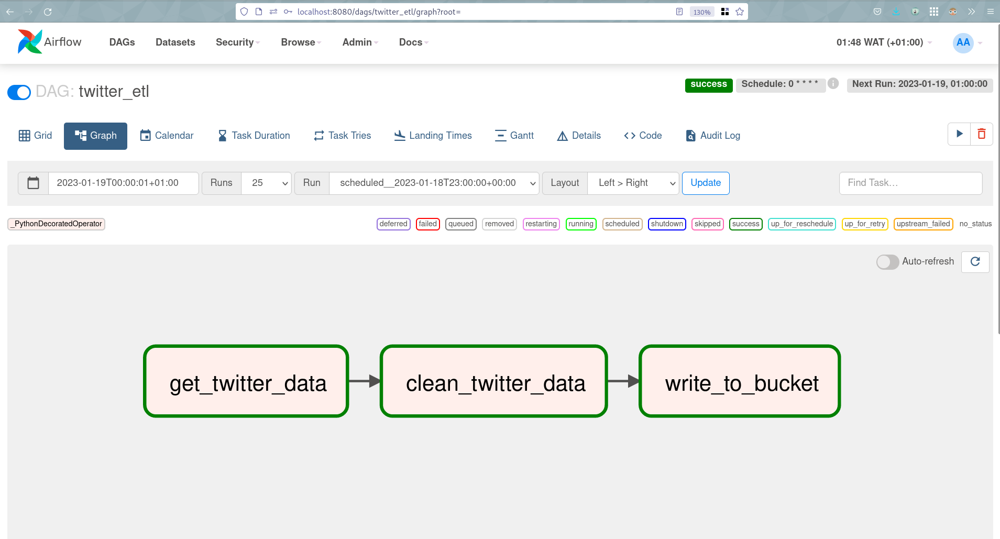
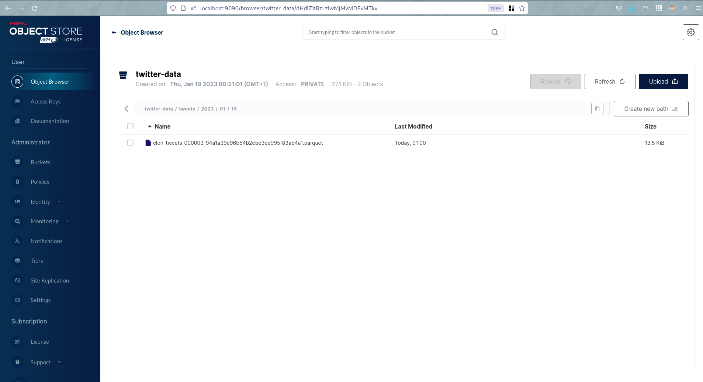
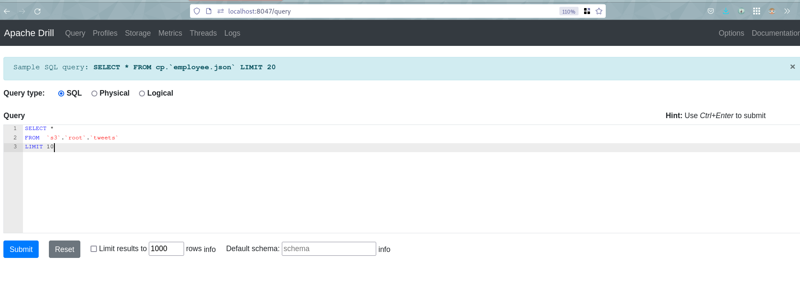
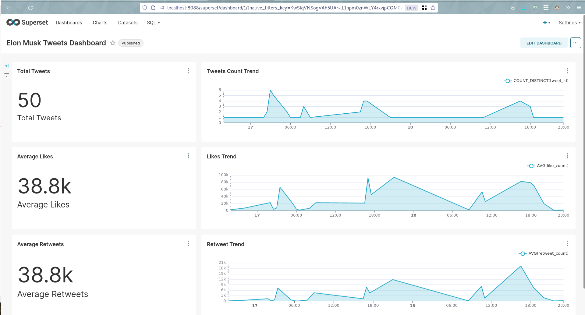

# Twitter Data Project with Airflow, MinIO, Drill & Superset

## Table of Contents

- [About](#about)
- [Getting Started](#getting_started)
- [Usage](#usage)
- [Resources](#resources)
- [etc.](#licence)

## About <a name = "about"></a>

A Data Project using Apache-Airflow (Orchestrator) and MinIO(Object Storage like s3), Apache-Drill (SQL Query Engine) and Apache-Superset (Visualization).

## Getting Started <a name = "getting_started"></a>

Below is a design of the project. (The drawio file can be found in `docs/architecture.drawio`:


## Prerequisites

- [docker-compose](https://docs.docker.com/compose/)
- [How to generate Twitter API Token](https://developer.twitter.com/en/docs/authentication/oauth-2-0/bearer-tokens)


## Usage <a name = "usage"></a>

1. We need to create and `.env` from [sample.env](./sample.env):
```bash
cp sample.env .env
```

2. Add the Twitter Bearer Token in the `.env` file as below:
```bash
TWITTER_BEARER_TOKEN="TOKEN-GOES-HERE"
```

3. 1 - If you want to change the `MINIO_BUCKET_NAME`, you have to change in the `conf/drill/storage-plugins-override.conf`:
```json
connection: "s3a://twitter-data"
```

3. 2 - If you want to change the `MINIO_ROOT_USER` and `MINIO_ROOT_PASSWORD`, you have to change in the `conf/drill/core-site.xml`:
```xml
<property>
    <name>fs.s3a.access.key</name>
    <value>minioadmin</value>
</property>

<property>
    <name>fs.s3a.secret.key</name>
    <value>minioadmin</value>
</property>
```

4. We can simply run the pipeline using `docker-compose`:

- If you are using linux, you need to change the permission of `apps/logs/` to allow the container to write to this directory:
```bash
chmod -R 777 app/logs superset.db
```

- **To START**
```bash
docker compose up -d
```

- **To SHUTDOWN**
```bash
docker compose down
```

5. Then we can connect to each below respectively:
- Apache-Airflow: http://localhost:8080

- MinIO Console: http://localhost:9090

- Apache-Drill: http://localhost:8047

- Apache-Superset: http://localhost:8088


## Resources <a name = "resources"></a>

- [How to generate Twitter API Token](https://developer.twitter.com/en/docs/authentication/oauth-2-0/bearer-tokens)
- [Apache-Airflow](https://airflow.apache.org)
- [Apache-Superset](https://superset.apache.org/)
- [Apache-Drill](https://drill.apache.org/)
- [MinIO](https://min.io)
- [docker-compose](https://docs.docker.com/compose/)

## License

This project is licensed under the MIT License - see the [LICENSE](LICENSE) file for details.

## Credits

See as you fit.

## Contact

If you have any questions or would like to get in touch, you can email: <mailto:mike.kenneth47@gmail.com>  OR [twitter](https://twitter.com/mikekenneth77)
